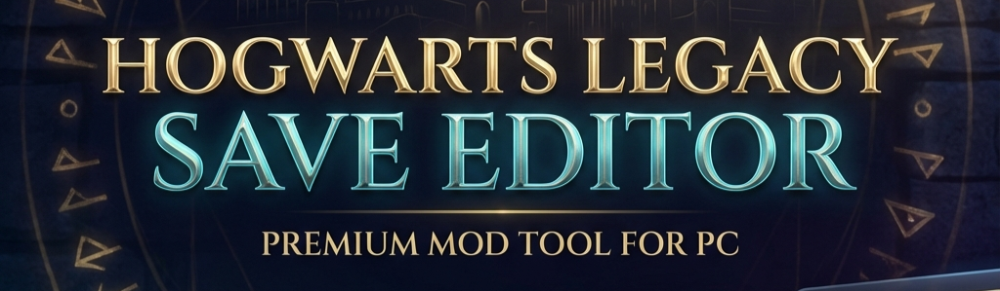

# 🧙 Hogwarts Legacy Save Editor & Manager



A modern, user-friendly GUI application for editing and managing Hogwarts Legacy save files.


## ✨ Features

- 📁 **Auto-detect** save files location (with manual override)
- ⚙️ **Configuration file** - remembers your last used folder
- 🔍 **Auto-find** required DLL from game folder (non-blocking)
- 🔓 **One-click** save extraction and editing
- 🌐 **Integrated editor** - opens directly in the app
- 💾 **Auto-save** - changes applied automatically when you click Download
- 📦 **Automatic backups** - never lose your progress
- 🎮 **Side-by-side windows** - manager on left, editor on right

## 📋 Requirements

### Required Files (place in same folder as app)

| File | Description | Source |
|------|-------------|--------|
| `hlsaves.exe` | Save compression tool | [Nexus Mods #1983](https://www.nexusmods.com/hogwartslegacy/mods/1983) (included) |
| `HLSGE.html` | Save editor | [Nexus Mods #77](https://www.nexusmods.com/hogwartslegacy/mods/77) (included) |
| `oo2core_9_win64.dll` | Oodle decompression | Copy from your game folder* |

### 🔍 How to find `oo2core_9_win64.dll` 

The app will first try to **automatically find and copy** this file from your installed games (e.g., Hogwarts Legacy).

**If auto-detection fails**, the app will offer to **Download** the file automatically:
1. Click **Yes** to download the official DLL from GitHub.
   - The app verifies the file's integrity (SHA256) automatically.
2. If download fails, you can click **No** to search your PC or select the file manually.

**Manual Instructions (if needed):**

**Common locations:**
- **Steam:** `C:\Program Files (x86)\Steam\steamapps\common\Hogwarts Legacy\Engine\Binaries\ThirdParty\Oodle\Win64\`
- **Epic Games:** `C:\Program Files\Epic Games\Hogwarts Legacy\Engine\Binaries\ThirdParty\Oodle\Win64\`

**Instructions:**
1. Navigate to the folder above
2. Copy `oo2core_9_win64.dll`
3. Paste it into the same folder as `HogwartsLegacy-SaveEditor.exe`

> **Note:** If you cannot find the file, you can download it separately from [GitHub releases](https://github.com/new-world-tools/go-oodle/releases/download/v0.2.3-files/oo2core_9_win64.dll).

### Python Dependencies (for running from source)

```
customtkinter>=5.0.0
tkinterdnd2>=0.3.0
pywebview>=4.0.0
```

## 🚀 Installation

### Option 1: Download Release (Recommended)
1. Download the latest release from [Releases](../../releases)
2. Extract to a folder
3. Add the required files listed above
4. Run `HogwartsLegacy-SaveEditor.exe`

### Option 2: Run from Source
```bash
# Clone the repository
git clone https://github.com/falker47/HogwartsLegacy-SaveEditor.git
cd HogwartsLegacy-SaveEditor

# Install dependencies
pip install -r requirements.txt

# Run
python main.py
```

### Option 3: Build Executable
```bash
# Install dependencies
pip install -r requirements-dev.txt

# Build
build.bat
```

## 📖 Usage

1. **Launch** the application
2. **Select** a save file from the list
3. **Click** "Edit Save File"
4. **Edit** your save in the integrated editor
5. **Click** "Download" in the editor
6. ✅ **Done!** Your save is updated automatically

## 📁 File Structure

```
HogwartsLegacy-SaveEditor/
├── main.py                        # Entry point
├── src/                           # Source modules
│   ├── app.py                     # Main application
│   ├── config.py                  # Configuration constants
│   ├── editor.py                  # Editor process logic
│   └── utils.py                   # Utility functions
├── assets/                        # Static assets
│   └── editor_bridge.js           # WebView bridge script
├── tests/                         # Unit tests
│   └── test_utils.py              # Utility tests
├── hlsaves.exe                    # Compression tool (required)
├── HLSGE.html                     # Save editor (required)
└── oo2core_9_win64.dll            # From game (required)
```

## 🔄 Changelog

### v1.03
- **FIXED:** Startup freeze on some systems caused by aggressive DLL search.
- **ADDED:** Configuration file (`config.json`) to save your preferred save directory.
- **ADDED:** Manual "Deep Search" option for DLLs (no longer runs automatically).
- **IMPROVED:** Updated DLL download source to a reliable GitHub repository.

### v1.02
- FIXED: "500 Internal Server Error" on launch for some users.
- IMPROVED: Editor now loads files directly instead of using a local server.

### v1.01
- Added automatic DLL download with hash verification.
- Improved error handling.

## 🎮 Where Are My Saves?

Hogwarts Legacy saves are located at:
```
%LOCALAPPDATA%\Hogwarts Legacy\Saved\SaveGames\[USER_ID]\
```

Backups are saved in:
```
[Save Location]\Backups\
```

## 🙏 Credits

### Developer
- **falker47** - Application development

### Contributors
- **Hawk-on** - Code refactoring and quality improvements on the html

### Special Thanks
- **Katt** - [hlsaves.exe](https://www.nexusmods.com/hogwartslegacy/mods/99) (MIT License)
- **ekaomk** - [HLSGE Save Editor](https://www.nexusmods.com/hogwartslegacy/mods/77)
- **CustomTkinter** - Modern Python UI framework
- **pywebview** - Integrated browser window

## 📄 License

This project is licensed under the MIT License - see the [LICENSE](LICENSE) file for details.

## ⚠️ Disclaimer

This tool is provided as-is. Always backup your saves before editing. The developer is not responsible for any lost or corrupted save data.

---

Made with ❤️ for the Hogwarts Legacy community
