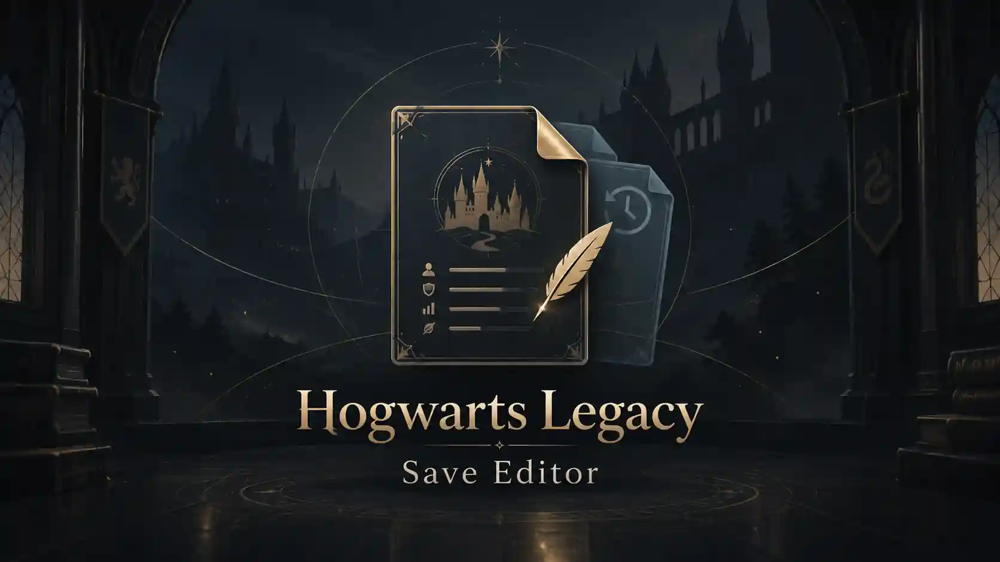

# Hogwarts Legacy Save Editor & Manager



A Windows desktop manager that connects three pieces of the Hogwarts Legacy save-editing workflow: save discovery and backups, `hlsaves` compression/decompression, and the HLSGE web editor inside a local PyWebView window.

Current v1.0.6 source adds guarded progression/resource editing, the in-game-style save
browser, verified Wand Handles/Revelio actions, and safe Game Pass export. Microsoft
Store/Game Pass WGS containers are never edited in place: **Export Game Pass Saves**
creates ordinary editable/migration copies and never writes changes back to WGS or Xbox
cloud storage. Player Apply changes only edited fields; XP and Talent Points enforce
the validated progression safeguards. See the [residual audit](docs/nexus-residuals-audit.md).

**Latest packaged release:** v1.0.6

## What this project adds

- automatic discovery of Hogwarts Legacy save folders, with manual override;
- persistent local configuration for the selected save directory;
- automatic backups before an edited save is written back;
- an integrated PyWebView workflow, so the editor opens next to the save manager instead of requiring manual upload/download steps;
- discovery of the required Oodle DLL from common Steam/Epic installations, plus an explicit user-triggered wider search;
- a small Python bridge that recompresses full-save downloads into the original save and exports raw DB1/DB2 downloads separately as SQLite files.

This repository is an integration project. It does **not** claim authorship of the external save-format/editor components listed under [Third-party components](#third-party-components).

## Architecture

```text
Hogwarts Legacy .sav
        |
        v
  hlsaves.exe
(decompress / recompress)
        |
        v
 temporary database
        |
        v
 HLSGE single-file editor
        |
        v
 assets/editor_bridge.js
        |
        v
 Python / PyWebView bridge
        |
        v
 original save + backup
```

The desktop layer is Python + CustomTkinter. The embedded editor source lives under `HLSE-src/` and is built with Vue/Vite into a single HTML file consumed by PyWebView.

## Requirements

- Windows
- Python 3.12+ when running from source
- Node.js 20+ when rebuilding the embedded editor
- `oo2core_9_win64.dll`, normally obtainable from an installed game that ships the compatible Oodle library

### Oodle DLL handling

The application first checks common Hogwarts Legacy Steam/Epic locations. If those checks fail, the user may explicitly start a broader local search or select the DLL manually.

The current v1.0.6 code also contains a hash-pinned fallback download from the third-party `new-world-tools/go-oodle` release assets. That source is **not an official Epic Games distribution channel**, and the DLL itself is not covered by this repository's MIT license. Prefer using the copy from your own installed game when available.

The DLL is intentionally excluded from this repository and from release packaging.

## Installation

### Packaged release

1. Download the latest ZIP from [GitHub Releases](../../releases/latest).
2. Extract it to a writable folder.
3. Run `HogwartsLegacy-SaveEditor.exe`.
4. Let the app locate `oo2core_9_win64.dll`, or provide it manually if needed.

### Run from source

```powershell
git clone https://github.com/falker47/HogwartsLegacy-SaveEditor.git
cd HogwartsLegacy-SaveEditor
powershell -NoProfile -ExecutionPolicy Bypass -File .\scripts\fetch_hlsaves.ps1
python -m pip install -r requirements.txt
python main.py
```

`fetch_hlsaves.ps1` installs the vendored **hlsavetool v2.0.1 + HL-02A** package (`2.0.1-hl02a.1`) without downloading this dependency. It verifies the ZIP, extracted executable and final destination SHA-256 before reporting success. The generated `assets/hlsaves.exe` stays ignored by Git. The minimal DB2 tail-parsing patch, hashes and reproducible build provenance are public under [third_party/hlsavetool](third_party/hlsavetool/PROVENANCE.md). The Oodle DLL is not included.

## Usage

1. Launch the manager.
2. Select the detected save folder or browse to it manually.
3. Select a save and choose **Edit Save File**.
4. Make changes in the integrated editor.
5. Use the editor's **Download** action.
6. The bridge writes the edited database and asks `hlsaves` to recompress it into the original save path.

For Microsoft Store / Game Pass, close the game and choose **Export Game Pass Saves**,
then select a destination outside WGS. The manager detects only the known Hogwarts
Legacy package, requires exactly one user folder marked by `containers.index`, and
copies recognized payloads byte-for-byte. Existing target files and conflicting save
identities stop the export; failed copies are rolled back. The exported folder then
opens in the same profile/save browser, with manual selection persisted.

These are editable/migration copies. **Edits do not return to Xbox/Game Pass cloud
storage.** No WGS files, indexes, or container metadata are changed. Real Game Pass
detection/export acceptance passed on **29 September 2026**; see
[safe-export validation](docs/gamepass-safe-export.md).

Raw DB1/DB2 downloads instead export SQLite files to a chosen destination without save recompression or write-back to the original save.

Backups are stored in a `Backups` directory under the selected save folder. Keep an independent backup before experimenting with save editors.

## Development and verification

### Python tests

```bash
python -m pip install pytest
python -m pytest -q tests/
```

The unit suite covers utility-level save-name parsing, file-size formatting and offline converter installation, including corrupt ZIP/EXE rejection and destination verification. Installer tests use Windows PowerShell or `pwsh` and are skipped when neither is available. It does **not** constitute end-to-end save-integrity certification.

### Embedded editor build

```bash
cd HLSE-src
npm ci
npm run build
```

The production Vite build emits a single-file editor at `HLSE-src/dist/client/index.html`.

### Release build

On Windows:

```bat
build_release.bat
```

The release builder installs the hash-pinned vendored converter, rebuilds the embedded editor, runs the Python tests, builds the executable with PyInstaller, and assembles the distributable with the converter license, patch and provenance while excluding the Oodle DLL. Python/Node dependency installation may still require network access; converter acquisition does not.

GitHub Actions checks Python tests and the frontend production build on Linux, plus a full Windows release smoke build that verifies the expected package contents and confirms that the Oodle DLL is absent.

## Repository map

```text
.
├── main.py
├── src/                    # desktop manager and PyWebView integration
├── assets/
│   ├── HLSGE.html          # built embedded editor artifact
│   └── editor_bridge.js
├── scripts/
│   └── fetch_hlsaves.ps1   # offline, hash-verified converter installation
├── third_party/
│   ├── hlsavetool-LICENSE.txt
│   └── hlsavetool/         # pinned ZIP, local patch and provenance
├── HLSE-src/               # embedded editor source/customizations
├── tests/
├── docs/
├── build_release.bat
└── CREDITS.md
```

## Third-party components

This project depends on components with their own provenance and terms:

- **hlsaves / hlsavetool** — MIT compression/decompression utility credited to Katt, via `gx570s/hlsavetool` and parent `topche-katt/hlsavetool`. This project vendors a reproducible v2.0.1 build with the minimal HL-02A DB2 tail fix and verifies both archive and executable hashes.
- **HLSGE / Hogwarts Legacy Save Game Editor** — embedded web editor derived from the Nexus Mods project; its upstream permissions are separate from this repository's license.
- **oo2core_9_win64.dll** — proprietary Oodle runtime component; not distributed by this repository.

See [THIRD_PARTY_NOTICES.md](THIRD_PARTY_NOTICES.md) and [CREDITS.md](CREDITS.md) for the scope of attribution and licensing.

## Release history

- **v1.0.6** — recovery and compatibility release: restores guarded XP/Talent Points, Galleons and Wiggenweld editing; restores verified Wand Handles and Revelio page operations; adds a profile-aware in-game-style save browser with save metadata; adds safe byte-exact Game Pass/WGS export to ordinary copies; and retains dirty-field Player Apply, backup and WGS write-protection safeguards.
- **v1.0.5** — maintenance release: fixes raw DB1/DB2 exports so database downloads bypass save recompression; corrects hlsavetool DB2 tail parsing through the minimal HL-02A patch; vendors the reproducible, hash-verified hlsavetool package with its license, patch and provenance; hardens CI, the release flow and third-party provenance.
- **v1.0.4** — revert/unlock fixes.
- **v1.0.3** — configuration persistence, non-blocking DLL discovery flow, refactoring and editor enhancements.
- **v1.0.2** — direct local editor loading instead of the previous local-server path.
- **v1.0.1** — hash verification for the optional DLL download.
- **v1.0.0** — initial public release.

## License

The original desktop manager, integration code, and other code authored for this repository are licensed under the [MIT License](LICENSE).

That license does **not** automatically relicense bundled or derived third-party material. HLSGE, `hlsaves`, the Oodle DLL, game data, trademarks, and other external assets remain subject to their respective upstream terms. See [THIRD_PARTY_NOTICES.md](THIRD_PARTY_NOTICES.md).

## Disclaimer

This is an unofficial fan-made utility and is not affiliated with Avalanche Software, Warner Bros. Games, Epic Games, or the authors of the third-party tools it integrates. Save editing can corrupt progress; keep backups and test changes carefully.
